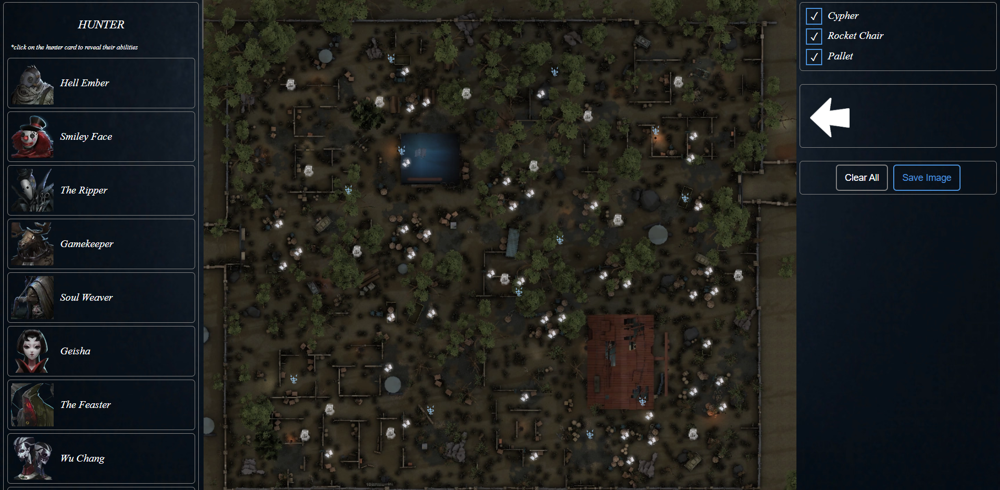

<p align="center">
  <a href="#idv-planner">🇬🇧 English</a> •
  <a href="#idv-planner-bahasa-indonesia">🇮🇩 Bahasa Indonesia</a>
</p>

# IDV Planner

A web-based strategy planner for **Identity V**. Drag and drop hunters, hunter abilities, survivors, and arrows onto interactive map layouts to plan strategies, mark cyphers, rocket chairs, and pallets, then export your plan as an image.



**🔗 Live Demo:** [idv-planner.vercel.app](https://idv-planner.vercel.app/)

## Features

- 🖱️ **Drag & drop** hunters, hunter abilities, survivors, and arrows directly onto the map
- 🔄 **Rotate & resize** placed arrow icons using on-map handles
- 📍 **Move** placed icons freely around the map
- 👁️ **Toggle visibility** of map objects (cyphers, rocket chairs, pallets) by category
- 🧹 **Clear all** placed icons with one click
- 💾 **Export** your finished plan as a PNG image
- 📖 Expandable hunter cards showing their abilities

## Tech Stack

- [React 19](https://react.dev/) + [TypeScript](https://www.typescriptlang.org/)
- [Vite](https://vite.dev/) — build tool & dev server
- [@dnd-kit/react](https://next.dndkit.com/) — drag-and-drop functionality
- [html-to-image](https://github.com/bubkoo/html-to-image) — exporting the map as an image
- [ESLint](https://eslint.org/) + [typescript-eslint](https://typescript-eslint.io/) — linting

## Getting Started

### Prerequisites

- [Node.js](https://nodejs.org/) (recommended: latest LTS)
- npm (comes with Node.js)

### Installation

```bash
git clone <repository-url>
cd idv-planner
npm install
```

### Running the Dev Server

```bash
npm run dev
```

The app will be available at `http://localhost:5173` (default Vite port).

### Building for Production

```bash
npm run build
```

### Other Scripts

| Script | Description |
| --- | --- |
| `npm run lint` | Run ESLint checks |
| `npm run preview` | Preview the production build locally |

---

# IDV Planner (Bahasa Indonesia)

Sebuah aplikasi web perencana strategi untuk **Identity V**. Seret dan letakkan (drag & drop) hunter, kemampuan hunter, survivor, dan arrow ke peta interaktif untuk menyusun strategi, menandai cypher, rocket chair, dan pallet, lalu ekspor rencana kamu sebagai gambar.

**🔗 Live Demo:** [idv-planner.vercel.app](https://idv-planner.vercel.app/)

## Fitur

- 🖱️ **Drag & drop** hunter, kemampuan hunter, survivor, dan arrow langsung ke peta
- 🔄 **Putar & ubah ukuran** ikon arrow yang sudah diletakkan menggunakan handle di peta
- 📍 **Pindahkan** ikon yang sudah diletakkan secara bebas di peta
- 👁️ **Tampilkan/sembunyikan** objek peta (cypher, rocket chair, pallet) per kategori
- 🧹 **Hapus semua** ikon yang diletakkan dengan satu klik
- 💾 **Ekspor** rencana yang sudah jadi sebagai gambar PNG
- 📖 Kartu hunter yang bisa dibuka untuk menampilkan daftar kemampuannya

## Teknologi yang Digunakan

- [React 19](https://react.dev/) + [TypeScript](https://www.typescriptlang.org/)
- [Vite](https://vite.dev/) — build tool & dev server
- [@dnd-kit/react](https://next.dndkit.com/) — fungsi drag-and-drop
- [html-to-image](https://github.com/bubkoo/html-to-image) — mengekspor peta menjadi gambar
- [ESLint](https://eslint.org/) + [typescript-eslint](https://typescript-eslint.io/) — linting kode

## Memulai

### Prasyarat

- [Node.js](https://nodejs.org/) (disarankan versi LTS terbaru)
- npm (sudah termasuk saat instal Node.js)

### Instalasi

```bash
git clone <repository-url>
cd idv-planner
npm install
```

### Menjalankan Dev Server

```bash
npm run dev
```

Aplikasi akan berjalan di `http://localhost:5173` (port default Vite).

### Build untuk Produksi

```bash
npm run build
```

### Script Lainnya

| Script | Deskripsi |
| --- | --- |
| `npm run lint` | Menjalankan pengecekan ESLint |
| `npm run preview` | Melihat pratinjau hasil build produksi secara lokal |

---

## Contact / Kontak

- 💼 LinkedIn: [linkedin.com/in/aidilkamal](https://linkedin.com/in/aidilkamal)
- 📧 Email: [aidilkamal.eng@gmail.com](mailto:aidilkamal.eng@gmail.com)

---

© 2026 M. Aidil Kamal Adlim. All rights reserved.